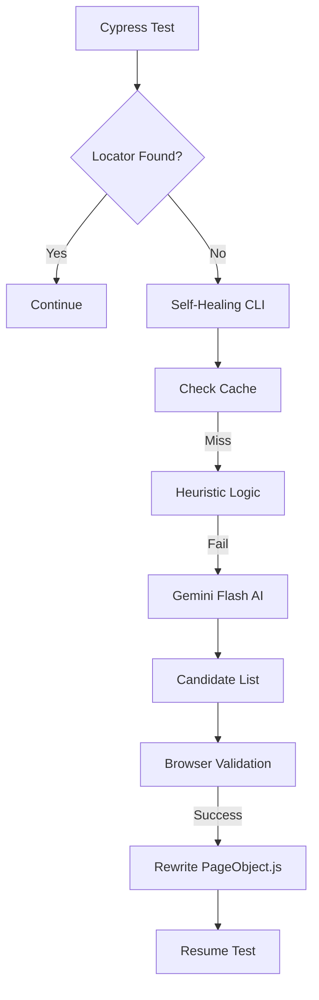

# Nexus AI: Resilient Test Automation Engine
## Interview Case Study & Project Explanation

This document is designed to help you explain the architecture, technical decisions, and business value of your framework during senior-level SDET interviews.

---

### 1. The "Problem" (The Hook)
**The Pitch:** "Most automation suites fail not because of bugs, but because of **maintenance debt.** UI changes cause locators to break, leading to false negatives and 'flake.' In my project, I solved this by treating healing as a first-class citizen using Generative AI."

**Key Pain Points Solved:**
*   **Maintenance Overhead:** Constant updates needed for Page Objects.
*   **Test Flakiness:** Tests failing due to minor DOM shifts (e.g., class name updates).
*   **Siloed Intelligence:** UI and API tests running in different worlds with separate reports.

---

### 2. The Solution: Hybrid Resilience Architecture
Nexus AI is a multi-layered framework built on **Cypress (UI)** and **Rest Assured (API)**, orchestrated via a **Node.js Self-Healing Engine.**

#### Core Tech Stack:
*   **UI Core:** Cypress (JavaScript).
*   **API Core:** Java (Rest Assured + TestNG).
*   **AI Engine:** Gemini 1.5 Flash (via `@google/generative-ai`).
*   **Validation Layer:** `htmlparser2` & `css-select` (Server-side DOM evaluation).
*   **Reporting:** Allure 3 (Unified Dashboard with History & Trends).

---

### 3. The "X-Factor": 4-Layer Self-Healing Pipeline
*This is the most important technical detail to explain.*

When a locator fails, the framework doesn't just error out. It triggers a **Recovery Pipeline**:
1.  **Cache Layer (L0):** Instantly checks a local JSON database for previously successful AI heals.
2.  **Heuristic Layer (L1):** Performs fuzzy matching based on stable attributes (ID, Name, Label) locally to save cost/latency.
3.  **AI Layer (L2):** If local logic fails, a cleaned DOM snippet is sent to **Gemini Flash**. The AI returns a ranked list of 3-5 alternative CSS selectors.
4.  **Validation & Patching (L3):** The browser validates the AI's suggestions. If verified, the system **Auto-Patches** the actual `.js` Page Object source code permanently.

---

### 4. Senior-Level Engineering Considerations
Interviewers love to hear about "Production Hardening." Mention these fixes we implemented:

*   **Rate-Limit Protection:** Implemented a 10s cooldown backoff for 429 errors to protect API quotas.
*   **Infinite Loop Blockade:** Added a "Circuit Breaker" that stops healing after 2 attempts per selector to prevent test hangs.
*   **Cost Control:** Global quota limits (max 5 AI calls per run) and mandatory high-confidence caching.
*   **Semantic Sanity:** The engine validates that if you were looking for an "input," the AI doesn't suggest a "div."

---

### 5. Common Interview Q&A for this Project

**Q: Doesn't AI healing make tests slow?**
*   **A:** No. We use an "Early Exit" strategy. Total execution time for a successful heal is ~2-4 seconds, but we save hours of manual debugging. Plus, the Cache layer means the AI is only called once per broken locator.

**Q: How do you handle AI hallucinations?**
*   **A:** We never blindly trust the AI. Every suggestion is validated against the live DOM using jQuery and semantic rules (tag type + visibility) before it is accepted.

**Q: Why separate UI (Cypress/JS) and API (Java/Maven)?**
*   **A:** To leverage the "Best of Both Worlds." Cypress provides the best developer experience for UI/E2E, while Rest Assured is the industry standard for high-performance, contract-heavy API testing. We unify them at the **Reporting Layer (Allure)**.

---

### 6. Architectural Diagram (Mental Model)

